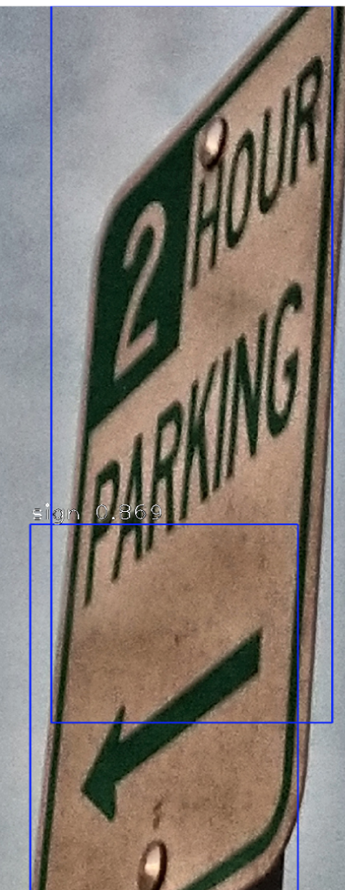
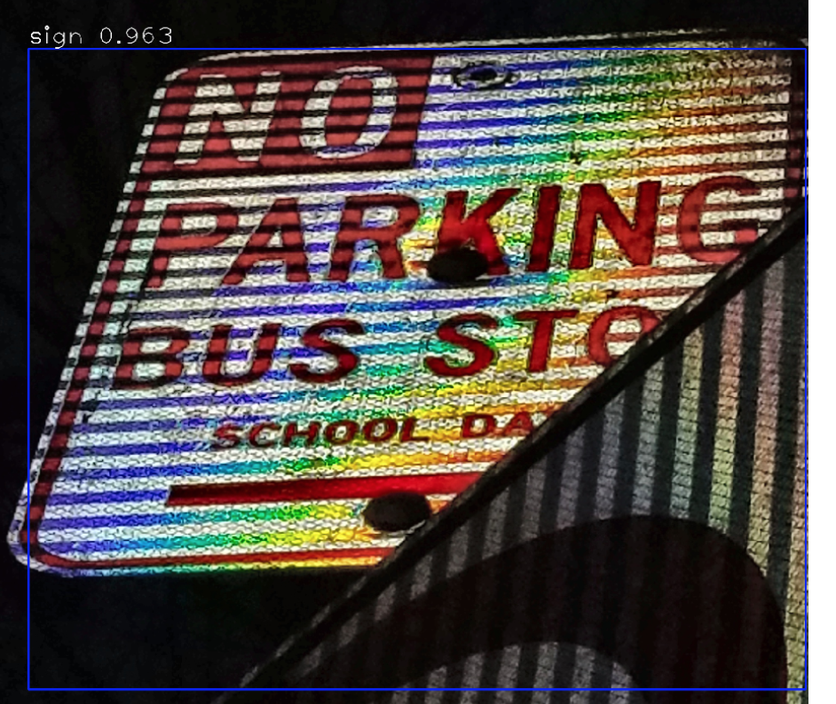

# curbmap-ml
ML aspects of curbmap

## Image Pipeline
----
Problem: A user uploads a photo of multiple street signs in one image.
1. Preprocess
    1. Verify that upload location indicated is related to EXIF data
    2. Contrast Limited Histogram Equalization of image (CLAHE) of LAB image
    3. Reduce image size to max dimension < 2600 using Lanczos4 interpolation sinc approx
    4. Grayscale image (possibly not right to do since some images have Red nos and such)
2. Bounding boxes for signs (CNN)
    1. [RetinaNet](https://github.com/fizyr/keras-retinanet)
    2. Cannot use trained weights from COCO since there is no general sign category (only a trained "stop sign" one). Developed dataset of ~11000 annotations (too small) which has two categories (sign - ~5000 or notsign - ~6000). The dataset comes from a combination of two of ImageNet's synsets (n06793231 and n06794110). There is definitely some overlap of the two sets of images. However, hopefully, this will allow enough space for RetinaNet to learn the bounding boxes of signs. Training is happening now (though only on a NVIDIA 1070SC... it'll take days)
    3. WIP:    This image shows the result of an image that has bounding boxes predicted on it. With ~93% confidence, the algorithm has identified the sign.
    4. Run trained model on input photos from testing dataset to be collected to see if we get decent bounding boxes for signs.
        1. From testing it seems photos of signs in daylight or when taken with a flash are detected with the highest confidence. Additionally, photos with some graniness and shot from strange angles produce lower confidences such as in:   This image produces two bounding boxes with moderately lower confidences.
        2. Whereas even lowlight with flash and strange angles produces very high confidence regions:  
          
        3. We will select photos with a high enough bounding box localization confidence to move onto the next stage (i.e. getting points and skewing the bounded region to adequately detect the text).
    5. Crop segments from image into sub "signs"
3. Orient/upright/straighten the sign in each box
4. Extract the text in the box
5. Determine meaning from the text

## Determine related map information from nearby information
---
Problem: Given a street, can we predict a similar restricted street
1. 
